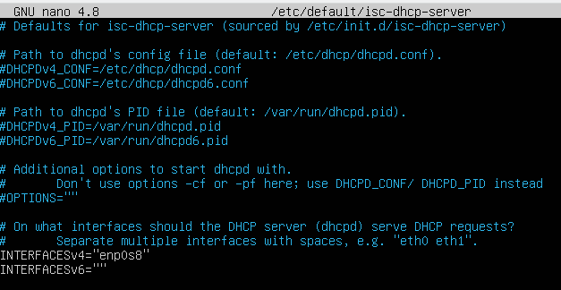
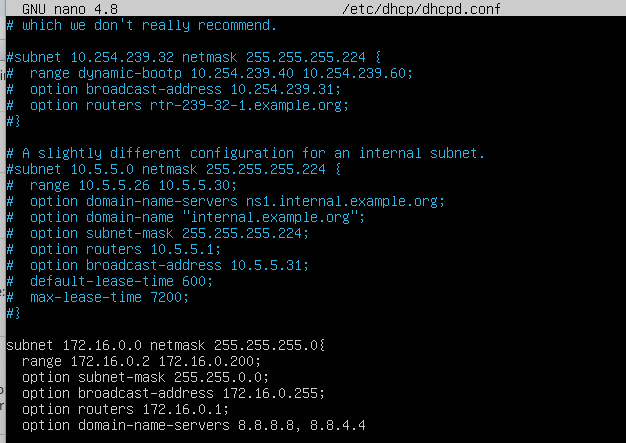
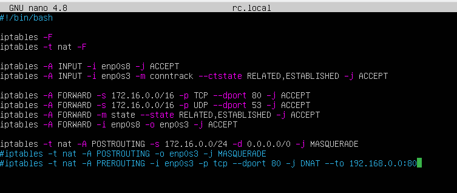
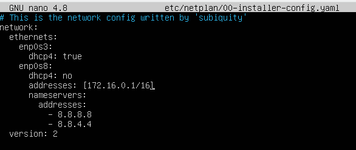
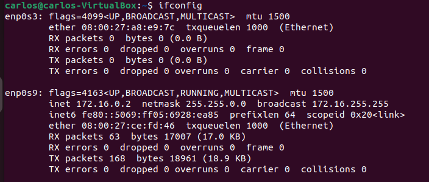
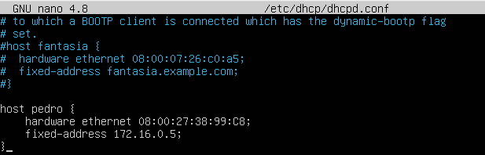
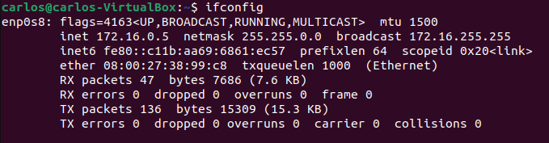

# dhcp-server

Vamos a modificar un ubuntu server para hacer un server dhcp.
Lo primero será dentro de la maquina virtual instalar un isc-dhcp con la linea que aparece a continuación:

hecho esto hacemos un :
~~~
nano /etc/default/isc-dhcp-server
~~~

Entonces nos aparecera un documento tal como muestra la siguiente imagen, En este documento lo que estas configurando son los puertos por donde van a salir las ips.

Ahora vamos a configurar el dhcpd.conf de la siguiente manera:

