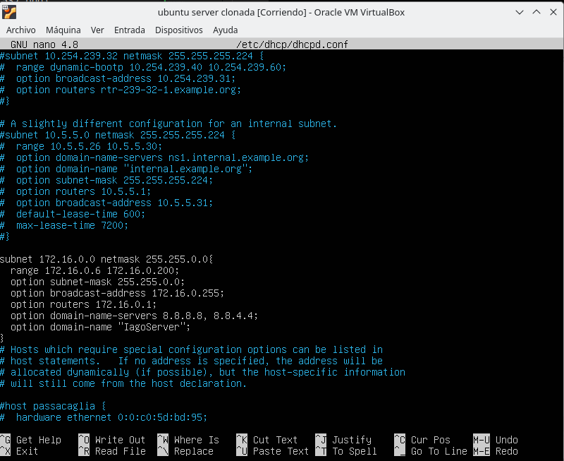

# dhcp-server

Vamos a modificar un ubuntu server para hacer un server dhcp.
Lo primero será dentro de la maquina virtual instalar un isc-dhcp con la linea que aparece a continuación:

hecho esto hacemos un :
~~~
nano /etc/default/isc-dhcp-server
~~~

Entonces nos aparecera un documento tal como muestra la siguiente imagen, En este documento lo que estas configurando son los puertos por donde van a salir las ips.

Ahora vamos a configurar el dhcpd.conf de la siguiente manera, así de esta forma dara ips dentro del rango acordado, no ponemos la 1 porque la 1 es del router.

Ahora tendremos que configurar las tablas de IPS sobre todo ponemos esta configuración para que todo pase por todas partes, hay cero filtro ahora mismo.

La siguiente configuracion es la de la configuracion del router, vamos principalmente sirve para darle su propia ip, que va a hacer dhcp y a donde se le dirige para buscar por google

Ahora vamos a confirmar que la maquina recibe ip del dhcp con un ifconfig lo confirmaremos, como corresponde en la imagen siguiente.

Ahora nos piden que demos una ip para una mac especifica, entonces con la siguiente configuración la otorgamos:

Ahora reconfiguramos el dhcpd.conf porque si no va a intentar dar la misma ip y no queremos que eso ocurra asi que ponemos que empiece a entregar a partir de la ip ya dada.

Ahora vamos a comprobar que entrego la ip por mac que queriamos, y con esto ya lo tendriamos

